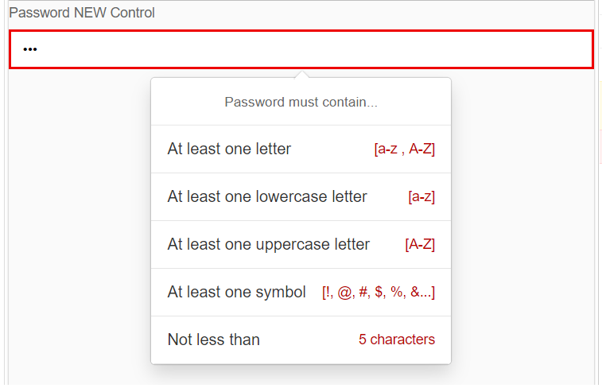

# openui5-password
An OpenUI5 Control which checks password strength and validates it against pre-defined rules.
The control is an input with password type and parameters to enable validation rules.

## Demo
You can checkout a live demo here:

https://mauriciolauffer.github.io/openui5-password/demo/webapp/index.html

[](https://raw.githubusercontent.com/mauriciolauffer/openui5-password/master/openui5-password.png)


## Getting started

### Installation
Install openui5-password as an npm module
```sh
$ npm install openui5-password
```

### Configure manifest.json
Add the library to *sap.ui5/dependencies/libs* and set its path in *sap.ui5/resourceRoots* in your manifest.json file, as follows:

```json
"sap.ui5": {
  "dependencies": {
    "libs": {
      "openui5.password": {}
    }
  },
  "resourceRoots": {
    "openui5.password": "./FOLDER_WHERE_YOU_PLACED_THE_LIBRARY/openui5/password/"
  }
}
```

### How to use
Import openui5-password to your UI5 controller using *sap.ui.require*:

```javascript
sap.ui.require([
  'openui5/password/Password'
], function (Password) {
  new Password({
    requireNumbers: true,
    requireLetters: true,
    requireSymbols: true,
    requireLowercase: true,
    requireUppercase: true,
    minLength: 5,
    maxLength: 42
  });
});
```

## Config Parameters
| Name | Type | Default| Description
| :---- | :------------------- | :---- | :---------  |
| maxLength | integer | 0 | Maximum number of characters. Value '0' means the feature is switched off.
| minLength | integer | 0 | Minimum number of characters. Value '0' means the feature is switched off.
| requireNumbers | boolean | true | Indicates that input must contain numbers
| requireSymbols | boolean | true | Indicates that input must contain symbols
| requireLetters | boolean | true | Indicates that input must contain letters
| requireLowercase | boolean | true | Indicates that input must contain lowercase letters
| requireUppercase | boolean | true | Indicates that input must contain uppercase letters
| score | integer | 0 | The score is a number which indicates the password strength.

## Author
Mauricio Lauffer

 - LinkedIn: [https://www.linkedin.com/in/mauriciolauffer](https://www.linkedin.com/in/mauriciolauffer)

## License
This project is licensed under the MIT License - see the [LICENSE](LICENSE) file for details
